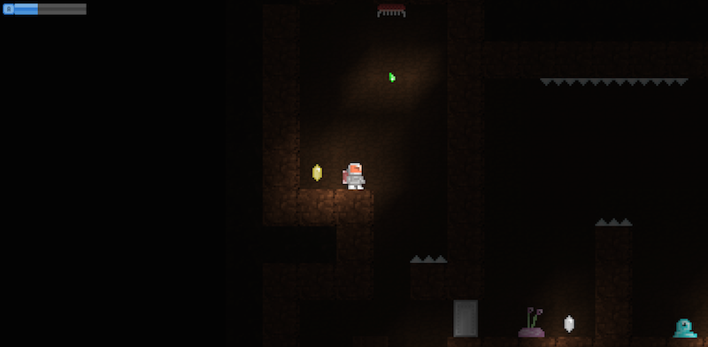

## Pixel Attach

A simple adventure game built in Unity 4.6 following the Unity 2D Essential Training with [Jesse Freeman](http://jessefreeman.com) tutorial on ([Lynda.com](http://www.lynda.com/Unity-2D-tutorials)). 

* [Play in Browser](https://cdn.rawgit.com/ChuckJHardy/PixelAttack/master/Builds/PixelAttackWeb/PixelAttack.html)
* [Download MacOSX App](./builds/PixelAttackMacOSX.zip)
* [Download Linux App](./builds/PixelAttackLinux.zip)
* [Download Windows App](./builds/PixelAttackWindows.zip)

### Installation

Clone the Repo:

    $ git clone git@github.com:ChuckJHardy/PixelAttack.git

Open Project in Unity:

    Unity -> Open Project -> Open Other -> [PixelAttack] -> Open
